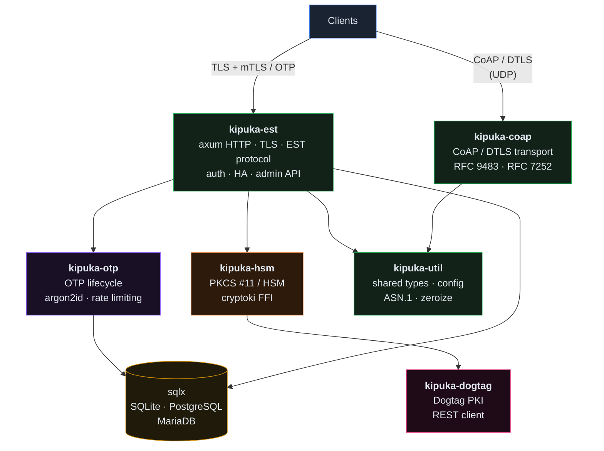
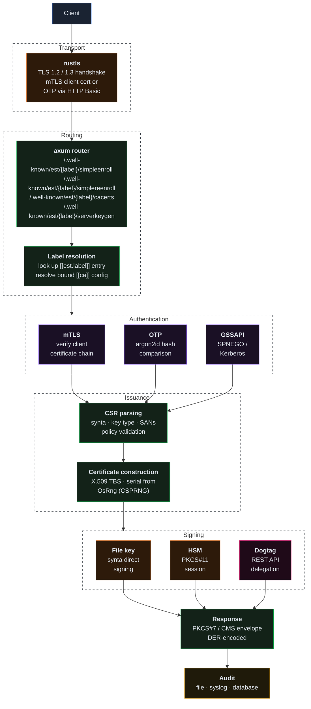
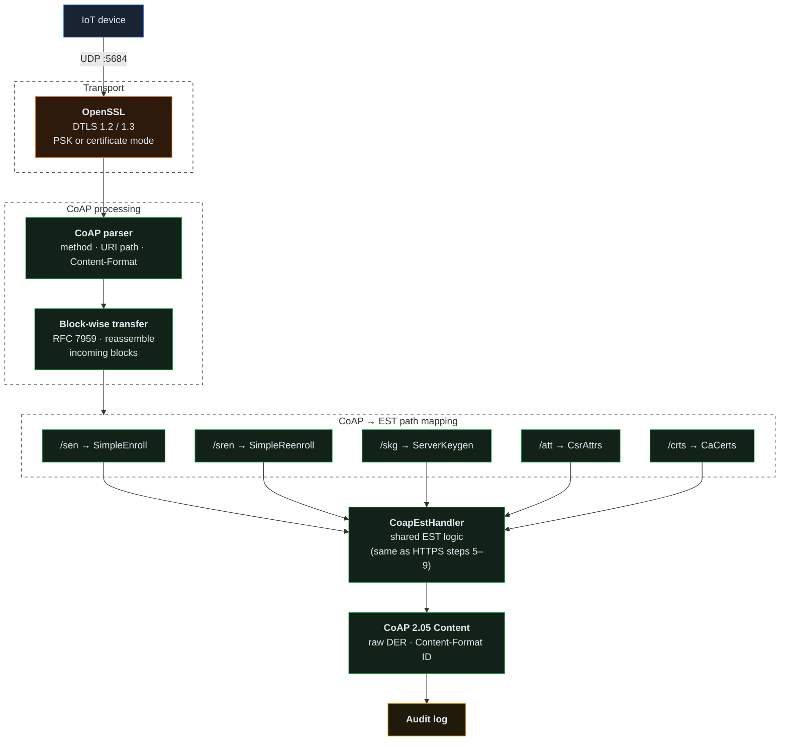
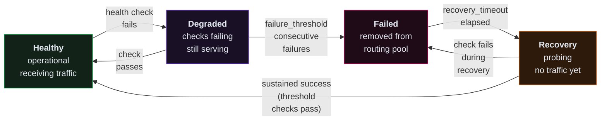
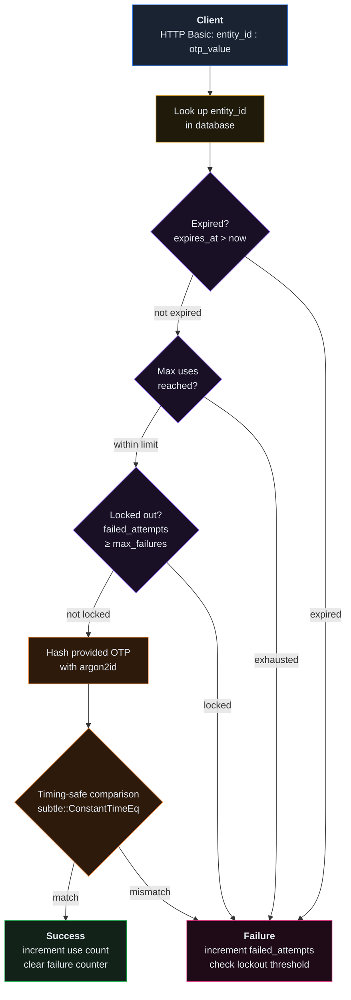
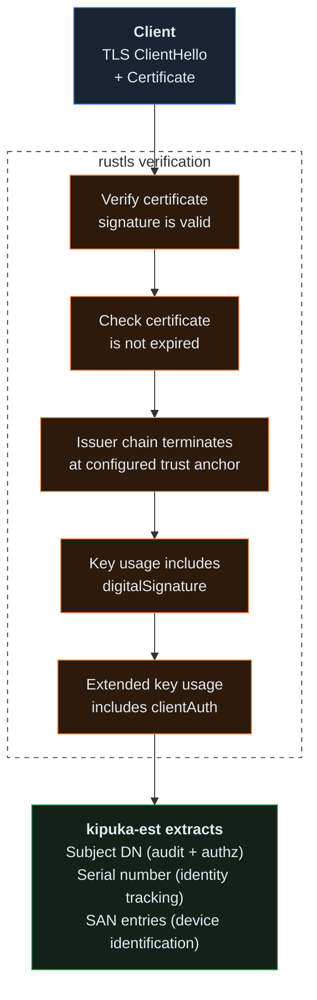
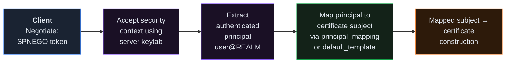
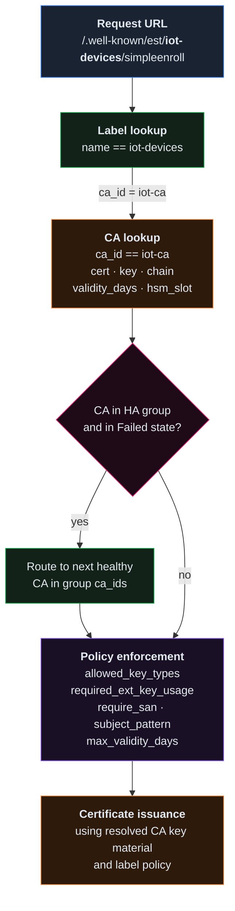

# Architecture

kipuka is structured as a Cargo workspace with six crates, each owning a
distinct responsibility.  This separation enforces module boundaries at the
compilation level and allows operators to build only the features they need.

## Workspace layout

### Crate responsibilities

| Crate | Role |
| ----- | ---- |
| **kipuka-est** | Core server binary.  Owns the axum HTTP router, TLS termination (rustls), EST protocol handlers (`/cacerts`, `/simpleenroll`, `/simplereenroll`, `/serverkeygen`, `/fullcmc`, `/csrattrs`), request authentication, CSR validation, certificate construction (via synta), the admin API, database access (sqlx), and the HA state machine. |
| **kipuka-hsm** | PKCS #11 integration via the `cryptoki` crate.  Provides a `Signer` trait implementation that delegates cryptographic operations to an HSM.  Handles slot enumeration, session management, key lookup, and sign operations.  Isolates all unsafe FFI behind a safe Rust API. |
| **kipuka-otp** | One-time password lifecycle: generation (CSPRNG), hashing (argon2id / bcrypt), storage, validation, rate limiting, and expiration.  Exposes an internal API consumed by kipuka-est for enrollment authentication and by the admin API for token provisioning. |
| **kipuka-util** | Shared types and configuration parsing.  Owns `kipuka.toml` deserialization (via serde + toml), X.509 helper functions, ASN.1 OID constants, error types, and the `zeroize`-aware wrappers for sensitive data. |
| **kipuka-dogtag** | REST client for Red Hat Certificate System / Dogtag PKI.  Translates EST enrollment requests into Dogtag profile-based certificate issuance calls, delegating signing to a full CA back-end instead of local key material. |
| **kipuka-coap** | CoAP/DTLS transport layer (RFC 7252 / RFC 9483) for constrained-device enrollment.  The `CoapDtlsServer` opens a UDP listener with DTLS 1.2/1.3 encryption (via OpenSSL), parses CoAP messages, and dispatches EST operations through the `EstHandler` trait.  Block-wise transfer (RFC 7959) splits large certificate payloads across multiple datagrams.  The main crate provides a `CoapEstHandler` that bridges CoAP requests to the shared EST enrollment logic, so both HTTPS and CoAP paths use identical CA signing, CSR validation, and audit code. |

Dependencies flow strictly downward: `kipuka-est` depends on all other crates;
leaf crates (`kipuka-util`, `kipuka-coap`) depend on nothing project-internal
except `kipuka-util`.

---

## EST operation data flow

A certificate enrollment request traverses one of two transport paths
-- HTTPS or CoAP/DTLS -- before reaching the shared EST enrollment logic.

### HTTPS transport (default)

### CoAP/DTLS transport (constrained devices)

Both paths converge on the same CSR validation, certificate construction, and
signing logic — the `EstHandler` trait abstracts transport details so the core
enrollment code is shared between HTTPS and CoAP.

---

## Multi-CA HA failover state machine

When `[ha]` is enabled, each CA in an `[[ha.group]]` transitions through four
states.  The HA controller runs periodic health checks and manages transitions
automatically.

**State definitions:**

- **Healthy** -- CA is operational.  Health checks pass.  Enrollment requests
  are routed to this CA normally.
- **Degraded** -- One or more health checks have failed but the threshold has
  not been reached.  The CA continues to receive traffic.  An alert is raised.
- **Failed** -- Consecutive failures have reached `failure_threshold`.  The CA
  is removed from the routing pool.  If the CA was the active node in an
  `active-passive` group, the next CA in `ca_ids` order is promoted.
- **Recovery** -- After `recovery_timeout` elapses, the HA controller begins
  probing the failed CA.  It must pass `failure_threshold` consecutive checks
  before returning to Healthy.  During recovery the CA does not receive
  enrollment traffic.

**Failover strategies** (set per `[[ha.group]]` or globally in `[ha]`):

| Strategy | Behavior |
| -------- | -------- |
| `active-passive` | First healthy CA in `ca_ids` order handles all requests.  Failover promotes the next CA in order. |
| `round-robin` | Requests are distributed across all healthy CAs in rotation. |
| `weighted` | CAs are weighted by a configurable priority; higher-priority CAs receive more traffic. |
| `latency-based` | Health check latency is tracked; requests are routed to the CA with the lowest observed latency. |

The health check itself performs a lightweight signing operation (or, for
Dogtag-backed CAs, a REST API ping) to verify that the CA can actually issue
certificates.  Network reachability alone is insufficient -- a reachable HSM
that has entered an error state must still be detected as unhealthy.

---

## Authentication flow

### OTP validation path

OTP values are never stored in plaintext.  The `argon2id` hash is computed at
token generation time and only the hash is persisted.  The raw token is
returned to the administrator exactly once in the generation response.

### mTLS certificate chain validation

### GSSAPI / Kerberos

---

## Database schema overview

kipuka uses sqlx with compile-time checked queries.  The schema is managed
through sequential migrations in `migrations/{sqlite,postgres,mariadb}/`.

### Core tables

**`otps`** -- One-time password state.

| Column | Type | Description |
| ------ | ---- | ----------- |
| `id` | INTEGER / SERIAL | Primary key |
| `entity_id` | TEXT | Client identifier (e.g., device hostname) |
| `otp_hash` | TEXT | Argon2id hash of the OTP value |
| `created_at` | TIMESTAMP | Token generation time |
| `expires_at` | TIMESTAMP | Token expiration time |
| `max_uses` | INTEGER | Maximum allowed uses |
| `use_count` | INTEGER | Current use count |
| `failed_attempts` | INTEGER | Consecutive failed validation attempts |
| `last_failure_at` | TIMESTAMP | Time of most recent failed attempt |
| `locked_until` | TIMESTAMP | Lockout expiration (NULL if not locked) |

**`audit_log`** -- Tamper-evident audit trail.

| Column | Type | Description |
| ------ | ---- | ----------- |
| `id` | INTEGER / SERIAL | Primary key |
| `timestamp` | TIMESTAMP | Event time (UTC) |
| `event_type` | TEXT | Event category (`enroll`, `renew`, `reject`, `otp_create`, etc.) |
| `entity_id` | TEXT | Client or device identifier |
| `ca_id` | TEXT | CA that processed the request |
| `label` | TEXT | EST label (NULL for unlabeled requests) |
| `auth_method` | TEXT | Authentication method (`mtls`, `otp`, `gssapi`) |
| `outcome` | TEXT | `success` or `failure` |
| `detail` | TEXT | Human-readable detail or error message |
| `cert_fingerprint` | TEXT | SHA-256 fingerprint of issued certificate (NULL on failure) |
| `client_ip` | TEXT | Source IP address |

**`certs`** -- Certificate inventory.

| Column | Type | Description |
| ------ | ---- | ----------- |
| `id` | INTEGER / SERIAL | Primary key |
| `serial_number` | TEXT | Certificate serial (hex-encoded) |
| `subject_dn` | TEXT | Subject distinguished name |
| `issuer_dn` | TEXT | Issuer distinguished name |
| `not_before` | TIMESTAMP | Validity start |
| `not_after` | TIMESTAMP | Validity end |
| `fingerprint` | TEXT | SHA-256 fingerprint |
| `ca_id` | TEXT | Issuing CA identifier |
| `label` | TEXT | EST label used for issuance |
| `entity_id` | TEXT | Associated entity (from OTP or mTLS subject) |
| `pem` | TEXT | Full PEM-encoded certificate (optional, controlled by config) |

---

## EST label routing

EST labels are the primary mechanism for multi-profile and multi-CA operation.
When a request arrives at `/.well-known/est/{label}/simpleenroll`, kipuka
resolves the label to a `[[est.label]]` configuration entry:

Requests without a label segment (e.g., `/.well-known/est/simpleenroll`) use
the first `[[ca]]` entry as the default CA with no additional label-level
policy enforcement.

When HA is enabled, label routing is extended: the label's `ca_id` is checked
against `[[ha.group]]` memberships.  If the CA belongs to an HA group and is in
a `Failed` state, the request is transparently routed to the next healthy CA in
the group's `ca_ids` list.  The label's policy constraints (key types, subject
pattern, etc.) are still enforced regardless of which CA in the group handles
the request.
